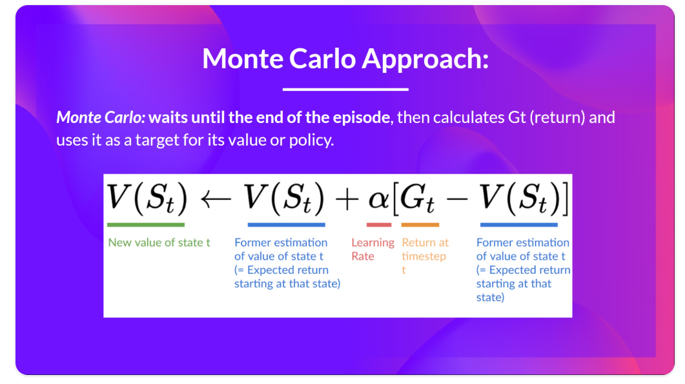
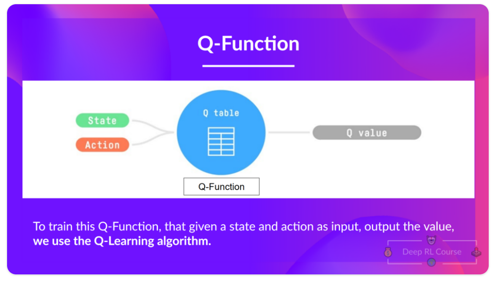

### UNIT 2 : Introduction to Q-Learning

#### 1. What is RL ? A short recap

Politic = brain of our agent
Our goal is to find an optimal policy π* , aka., a policy that leads to the best expected cumulative reward.

And to find this optimal policy (hence solving the RL problem), there are two main types of RL methods:

Policy-based methods: Train the policy directly to learn which action to take given a state.
Value-based methods: Train a value function to learn which state is more valuable and use this value function to take the action that leads to it.

#### 2. Two types of value-based methods

In value-based methods, we learn a value function that maps a state to the expected value of being at that state.

The goal of an RL agent is to have an optimal policy π*.

To find the optimal policy, we learned about two different methods:

Policy-based methods: Directly train the policy to select what action to take given a state (or a probability distribution over actions at that state). In this case, we don’t have a value function.
The policy takes a state as input and outputs what action to take at that state (deterministic policy: a policy that output one action given a state, contrary to stochastic policy that output a probability distribution over actions).

And consequently, we don’t define by hand the behavior of our policy; it’s the training that will define it.

Value-based methods: Indirectly, by training a value function that outputs the value of a state or a state-action pair. Given this value function, our policy will take an action.

So the difference is:

In policy-based training, the optimal policy (denoted π*) is found by training the policy directly.
In value-based training, finding an optimal value function (denoted Q* or V*, we’ll study the difference below) leads to having an optimal policy.

We see that the difference is:

For the state-value function, we calculate the value of a stateSt.​
 
For the action-value function, we calculate the value of the state-action pair (St,At) hence the value of taking that action at that state.

#### 3. The Bellman Equation: simplify our value estimation

L’équation de Bellman  simplifie notre calcul de la valeur d’état ou de la valeur d’action d’état.

The Bellman equation is a recursive equation that works like this: instead of starting for each state from the beginning and calculating the return, we can consider the value of any state as:

The immediate reward Rt+1 + the discounted value of the state that follows (γ∗V(St+1)).

If we go back to our example, we can say that the value of State 1 is equal to the expected cumulative return if we start at that state.

To calculate the value of State 1: the sum of rewards if the agent started in that state 1 and then followed the policy for all the time steps.

This is equivalent to V(St) ) = Immediate reward Rt+1 + Discounted value of the next state γ∗V(St+1).

To recap, the idea of the Bellman equation is that instead of calculating each value as the sum of the expected return, which is a long process, we calculate the value as the sum of immediate reward + the discounted value of the state that follows.

#### 4. Monte Carlo vs Temporal Difference Learning

* Monte Carlo : learning at the end of the episode

Monte Carlo waits until the end of the episode, calculates Gt  (return) and uses it as a target for updating V(St).

Gamma = discount des reward. Learning rate = vitesse à laquelle l'agent diot apprendre.
V(S0) = valeur de l'état.
Gt = récompenses cumulées (somme des épisodes à la fin d'un épisode)
V(s) = valeur d'un état
Q(s,a) = valeur d'une action dans un état

Patient, précis, moins d'approxiamtion. N'utilise pas la focntion de Bellman.

* Temporal Difference Learning: learning at each step

Temporal Difference, on the other hand, waits for only one interaction (one step)St+1 to form a TD target and updateV.

The idea with TD is to update the V(S t ) at each step.

But because we didn’t experience an entire episode, we don’t have
Gt  (expected return). Instead, we estimate
Gt by adding R t+1  and the discounted value of the next state.

#### 5. Mid-way Recap

We have two types of value-based functions:

State-value function: outputs the expected return if the agent starts at a given state and acts according to the policy forever after.
Action-value function: outputs the expected return if the agent starts in a given state, takes a given action at that state and then acts accordingly to the policy forever after.
In value-based methods, rather than learning the policy, we define the policy by hand and we learn a value function. If we have an optimal value function, we will have an optimal policy (pi *).

Action-value : plus gourmand en calcul.

There are two types of methods to update the value function:

With the Monte Carlo method, we update the value function from a complete episode, and so we use the actual discounted return of this episode (Gt, cumul des récompenses maximales).

With the TD Learning method, we update the value function from a step, replacing the unknownGt  with an estimated return called the TD target.

#### 6. Introducing Q-Learning

* What is Q-Learning?

Q-Learning is an off-policy value-based method that uses a TD approach to train its action-value function:

Q-Learning is the algorithm we use to train our Q-function, an action-value function that determines the value of being at a particular state and taking a specific action at that state.

The Q comes from “the Quality” (the value) of that action at that state.

The Q-table is initialized. That’s why all values are = 0. This table contains, for each state and action, the corresponding state-action values. (matrice de tous les états * les actions).

So: the Q-function uses a Q-table that has the value of each state-action pair. Given a state and action, our Q-function will search inside its Q-table to output the value.

In the beginning, our Q-table is useless since it gives arbitrary values for each state-action pair (most of the time, we initialize the Q-table to 0). As the agent explores the environment and we update the Q-table, it will give us a better and better approximation to the optimal policy.

* The Q-Learning algorithm
Step 1: We initialize the Q-table

Step 2: Choose an action using the epsilon-greedy strategy
The epsilon-greedy strategy is a policy that handles the exploration/exploitation trade-off.
At the beginning of the training, the probability of doing exploration will be huge since ɛ is very high, so most of the time, we’ll explore. But as the training goes on, and consequently our Q-table gets better and better in its estimations, we progressively reduce the epsilon value since we will need less and less exploration and more exploitation.

Step 3: Perform action At, get reward Rt+1 and next state St+1

Step 4: Update Q(St, At)

* Off-policy vs On-policy
The difference is subtle:

Off-policy: using a different policy for acting (inference) and updating (training).
For instance, with Q-Learning, the epsilon-greedy policy (acting policy), is different from the greedy policy that is used to select the best next-state action value to update our Q-value (updating policy).

On-policy: using the same policy for acting and updating.

#### 7. A Q-Learning example

To train our agent to have an optimal policy (so a policy that goes right, right, down), we will use the Q-Learning algorithm.

epsilon : ce qui fait choisir entre l'exploitation et l'exploration.

Step 1: Initialize the Q-table
Step 2: Choose an action using the Epsilon Greedy Strategy
Step 3: Perform action At, get Rt+1 and St+1
Step 4: Update Q(St, At)

As we continue exploring and exploiting the environment and updating Q-values using the TD target, the Q-table will give us a better and better approximation. At the end of the training, we’ll get an estimate of the optimal Q-function.

#### 8. Q-Learning Recap

Q-Learning is the RL algorithm that :

Trains a Q-function, an action-value function encoded, in internal memory, by a Q-table containing all the state-action pair values.

Given a state and action, our Q-function will search its Q-table for the corresponding value.

When the training is done, we have an optimal Q-function, or, equivalently, an optimal Q-table.

And if we have an optimal Q-function, we have an optimal policy, since we know, for each state, the best action to take.

#### 9. Glossaire

https://huggingface.co/learn/deep-rl-course/unit2/glossary

Learning rate haut : aime tous les muffins après en avoir mangé 1.
Learning rate bas : reste mefiant par rapport aux muffins (doit continuer de les goûter pour être sûr qu'il aime).

Why if we have an optimal Q-function Q* we have an optimal policy?
Because if we have an optimal Q-function, we have an optimal policy since we know for each state what is the best action to take.

What is Epsilon-Greedy Strategy?
Epsilon Greedy Strategy is a policy that handles the exploration/exploitation trade-off.

#### 10. Exercices

Frozen lake - https://huggingface.co/queenVdu13/q-FrozenLake-v1-4x4-noSlippery

Taxi - https://huggingface.co/queenVdu13/q-taxi-v1

